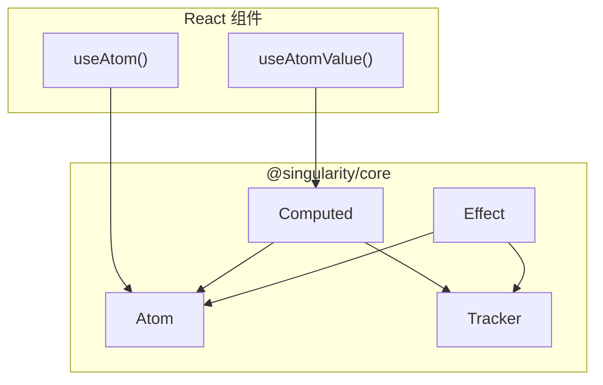
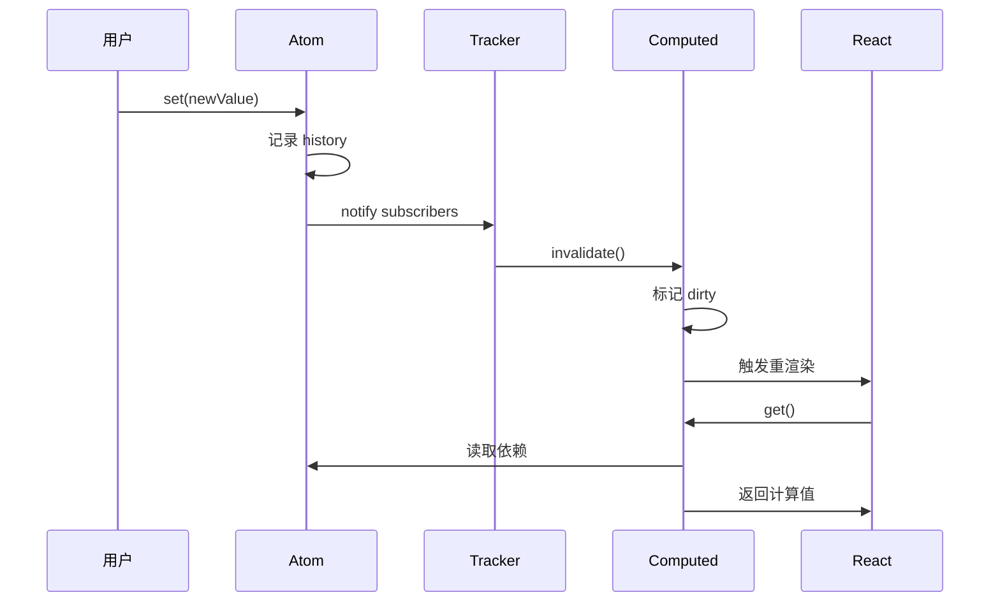

# 设计与路线图

> **Singularity = Zustand 的简单 + Redux 的追踪 + Jotai 的细粒度**
>
> 本文档包含设计原则、技术选型与实施路线图。

---

## 一、设计原则

### 1.1 核心哲学

> **「状态不是数据集合，而是可验证的变化史」**

这意味着：

- 每次状态变化都被记录
- 每个 bug 都能追溯到源头
- 系统行为可解释、可审计、可复现

### 1.2 设计目标

| 目标           | 具体要求                               |
| :------------- | :------------------------------------- |
| **极致简单**   | API 比 Zustand 更少，学习成本 < 5 分钟 |
| **开箱可追踪** | 无需配置，默认记录变化历史             |
| **细粒度更新** | Signal 级别响应式，避免无效渲染        |
| **体积小**     | 生产 ~3KB，开发 ~4KB                   |
| **框架无关**   | 核心与框架适配器分离                   |

### 1.3 非目标

| 不做                   | 理由                     |
| :--------------------- | :----------------------- |
| 服务端状态 (atomAsync) | React Query 做得更好     |
| 状态机 (machine)       | XState 做得更好          |
| 协作 (atomSync/CRDT)   | Yjs 做得更好             |
| 表单状态               | React Hook Form 做得更好 |

**原则：只做「客户端状态 + 追踪」这一件事，做到极致。**

---

## 二、技术选型

### 2.1 响应式核心

| 方案       | 优势                   | 劣势               | 决策      |
| :--------- | :--------------------- | :----------------- | :-------- |
| **Signal** | 细粒度更新、性能可预测 | 需要 `.get()` 语法 | ✅ 采用   |
| **Proxy**  | 写法自然               | 隐式依赖难追踪     | ❌ 不采用 |

### 2.2 React 适配

**强制使用 `useSyncExternalStore`**，保证并发模式兼容：

```typescript
import { useSyncExternalStore } from 'react';

export function useAtom<T>(atom: Atom<T>): T {
  return useSyncExternalStore(
    atom.subscribe,
    atom.get,
    atom.get, // SSR
  );
}
```

### 2.3 追踪实现

```typescript
// 开发模式：记录变化
if (process.env.NODE_ENV !== 'production') {
  history.push({
    from: oldValue,
    to: newValue,
    time: Date.now(),
  });
}

// 生产模式：零开销
```

---

## 三、架构分层

```
┌─────────────────────────────────────────────┐
│            Framework Adapters               │
│         (@singularity/react, vue)           │
├─────────────────────────────────────────────┤
│              State Layer                    │
│    ┌────────┬──────────┬─────────────┐     │
│    │  Atom  │ Computed │   Effect    │     │
│    └────────┴──────────┴─────────────┘     │
├─────────────────────────────────────────────┤
│          Scheduler & Batch                  │
│      (Batching, Dependency Graph)           │
├─────────────────────────────────────────────┤
│            Trace Layer                      │
│    (History, Snapshot, Time Travel)         │
└─────────────────────────────────────────────┘
```

### 依赖流向图



### 状态变化流程



---

## 四、包结构

```
packages/
├── core/                 # @singularity/core (~3KB)
│   ├── atom.ts           # 原子状态
│   ├── computed.ts       # 派生状态
│   ├── effect.ts         # 副作用
│   ├── batch.ts          # 批处理
│   ├── trace.ts          # 追踪层
│   └── index.ts
│
├── react/                # @singularity/react (~1KB)
│   ├── useAtom.ts
│   ├── useAtomValue.ts
│   └── index.ts
│
└── devtools/             # @singularity/devtools (v1.0)
    └── panel.tsx         # DevTools UI
```

---

## 五、实施路线图

> 详细开发任务请参阅 [development-guide.md](./development-guide.md)

---

## 六、API 分层

```
Level 0 (必学)：atom, useAtom              → 覆盖 80% 场景
Level 1 (按需)：computed, effect           → 派生与副作用
Level 2 (进阶)：batch, history, restore    → 批量与调试
```

**新手只需 5 分钟学会 Level 0。**

---

## 七、Kill Criteria

| 检查点 | 终止条件                         | 后续动作         |
| :----- | :------------------------------- | :--------------- |
| Week 3 | atom/computed 性能不及 Jotai 80% | 重新评估技术选型 |
| Week 5 | React 并发模式无法兼容           | 切换到其他方案   |
| Week 8 | 试点反馈「比 Zustand 复杂」      | 简化 API         |

---

_设计文档 v2.0 - 2026-01-08_
