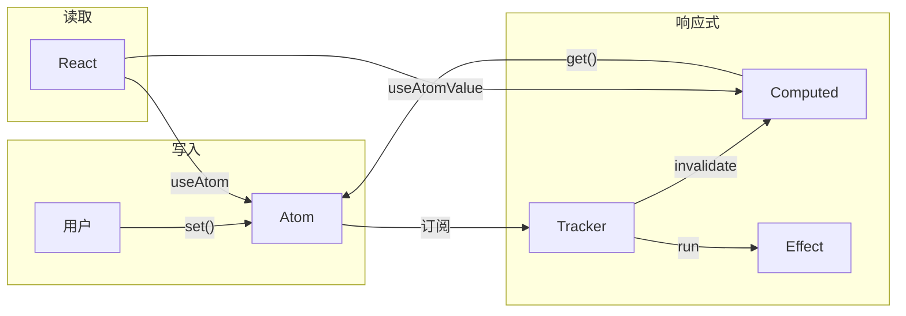

# 开发实施文档

> 本文档是 Singularity 的**唯一开发指南**，阅读后可直接开始编码。

---

## 一、项目概述

### 1.1 定位

**Singularity** = Zustand 的简单 + Redux 的追踪 + Jotai 的细粒度

### 1.2 为什么从底层设计？

| 问题                | 能用插件解决吗？ | 原因                            |
| :------------------ | :--------------- | :------------------------------ |
| 给 Zustand 加追踪   | ✅ 能            | 中间件已存在                    |
| 给 Jotai 加追踪     | ✅ 能            | devtools 已存在                 |
| 给 Zustand 加细粒度 | ❌ **不能**      | 架构决定（单 store + selector） |
| 给 Jotai 简化 API   | ❌ **不能**      | 原子组合是核心设计哲学          |

> Zustand 的「非细粒度」是架构问题，Jotai 的「API 复杂」是设计哲学。三合一组合必须从底层重新设计。

### 1.3 目标指标

| 指标     | 目标              |
| :------- | :---------------- |
| API 数量 | ≤ 5 个            |
| 学习时间 | ≤ 5 分钟          |
| 包体积   | 生产~3KB 开发~4KB |
| 性能     | ≥ Jotai 80%       |

### 1.4 包结构

```
packages/
├── core/                 # @singularity/core (~3KB)
│   ├── src/
│   │   ├── atom.ts       # 原子状态
│   │   ├── computed.ts   # 派生状态
│   │   ├── effect.ts     # 副作用
│   │   ├── batch.ts      # 批处理
│   │   ├── trace.ts      # 追踪层
│   │   └── index.ts
│   └── __tests__/
│
└── react/                # @singularity/react (~1KB)
    ├── src/
    │   ├── useAtom.ts
    │   ├── useAtomValue.ts
    │   └── index.ts
    └── __tests__/
```

---

## 二、技术栈与依赖

### 2.1 技术栈

| 类别       | 选型       | 版本  | 说明                   |
| :--------- | :--------- | :---- | :--------------------- |
| **语言**   | TypeScript | ^5.0  | 严格模式               |
| **包管理** | pnpm       | ^8.0  | workspace 支持         |
| **构建**   | tsup       | ^8.0  | esbuild 封装，快速构建 |
| **测试**   | vitest     | ^1.0  | 兼容 Jest API          |
| **框架**   | React      | ^18.0 | useSyncExternalStore   |

### 2.2 第三方库

| 包名                   | 用途              | 必需 |
| :--------------------- | :---------------- | :--- |
| `typescript`           | 类型检查          | ✅   |
| `tsup`                 | 打包构建          | ✅   |
| `vitest`               | 单元测试          | ✅   |
| `react`                | React 适配器      | ✅   |
| `react-dom`            | React 渲染        | ✅   |
| `@types/react`         | React 类型        | ✅   |
| `@types/react-dom`     | React DOM 类型    | ✅   |
| `@testing-library/react` | React Hook 测试 | ✅   |
| `jsdom`                | 测试 DOM 环境     | ✅   |
| `tsx`                  | 运行 TS 脚本      | ✅   |

### 2.3 开发工具

| 工具       | 用途       | 推荐    |
| :--------- | :--------- | :------ |
| VS Code    | 编辑器     | ✅      |
| ESLint     | 代码规范   | 可选    |
| Prettier   | 代码格式化 | 可选    |
| Changesets | 版本管理   | v1.0 后 |

### 2.4 浏览器兼容

| 浏览器  | 最低版本 |
| :------ | :------- |
| Chrome  | 80+      |
| Firefox | 78+      |
| Safari  | 14+      |
| Edge    | 80+      |

> **Node.js 要求**：>=18.0.0

---

## 三、开发环境

### 3.1 初始化

```bash
mkdir singularity && cd singularity
pnpm init

# 创建 pnpm-workspace.yaml
cat > pnpm-workspace.yaml << 'EOF'
packages:
  - 'packages/*'
EOF

# 创建目录结构
mkdir -p packages/core/src packages/core/__tests__
mkdir -p packages/react/src packages/react/__tests__

# 安装依赖
pnpm add -D typescript tsup vitest tsx -w
pnpm add -D react react-dom @types/react @types/react-dom -w
pnpm add -D @testing-library/react jsdom -w
```

### 3.2 TypeScript 配置

```json
// tsconfig.json
{
  "compilerOptions": {
    "target": "ES2020",
    "module": "ESNext",
    "moduleResolution": "bundler",
    "strict": true,
    "declaration": true
  }
}
```

### 3.3 包配置

```json
// packages/core/package.json
{
  "name": "@singularity/core",
  "version": "0.1.0",
  "type": "module",
  "main": "./dist/index.js",
  "types": "./dist/index.d.ts",
  "scripts": {
    "build": "tsup src/index.ts --format esm --dts",
    "test": "vitest"
  }
}
```

```json
// packages/react/package.json
{
  "name": "@singularity/react",
  "version": "0.1.0",
  "type": "module",
  "main": "./dist/index.js",
  "types": "./dist/index.d.ts",
  "peerDependencies": {
    "react": ">=18.0.0",
    "@singularity/core": ">=0.1.0"
  },
  "devDependencies": {
    "@singularity/core": "workspace:*"
  },
  "scripts": {
    "build": "tsup src/index.ts --format esm --dts",
    "test": "vitest --environment jsdom"
  }
}
```

```json
// packages/react/tsconfig.json
{
  "extends": "../../tsconfig.json",
  "compilerOptions": {
    "jsx": "react-jsx",
    "types": ["react", "react-dom"]
  },
  "include": ["src"]
}
```

---

## 四、核心实现

### 数据流概览



### 3.1 atom.ts

```typescript
import { trackDependency, assertWritable } from './trace';
import { isBatching, schedulePendingUpdate } from './batch';

type Listener = () => void;

interface HistoryEntry<T> {
  from: T;
  to: T;
  time: number;
}

let atomId = 0;

export function atom<T>(initial: T) {
  const id = `atom:${++atomId}`;
  let value = initial;
  const listeners = new Set<Listener>();
  const history: HistoryEntry<T>[] = [];

  const notify = () => {
    listeners.forEach((fn) => fn());
  };

  return {
    id,

    get() {
      trackDependency(this);
      return value;
    },

    set(next: T | ((prev: T) => T)) {
      assertWritable();
      const newValue =
        typeof next === 'function' ? (next as (prev: T) => T)(value) : next;

      if (Object.is(value, newValue)) return;

      // 开发模式：记录历史
      if (process.env.NODE_ENV !== 'production') {
        history.push({ from: value, to: newValue, time: Date.now() });
        if (history.length > 100) history.shift(); // 限制长度
      }

      value = newValue;

      if (isBatching()) {
        schedulePendingUpdate(notify);
      } else {
        notify();
      }
    },

    subscribe(listener: Listener) {
      listeners.add(listener);
      return () => listeners.delete(listener);
    },

    history() {
      return [...history];
    },

    restore(index: number) {
      assertWritable();
      const entry = history[index];
      if (!entry) return;

      value = entry.from; // restore 不应新增历史记录
      if (isBatching()) {
        schedulePendingUpdate(notify);
      } else {
        notify();
      }
    },
  };
}

export type Atom<T> = ReturnType<typeof atom<T>>;
```

### 3.2 computed.ts

```typescript
import { Tracker, startTracking, stopTracking, trackDependency } from './trace';

let computedId = 0;
const computingStack: string[] = [];

function enterComputed(id: string): void {
  if (computingStack.includes(id)) {
    const chain = [...computingStack, id].join(' -> ');
    throw new Error(`Circular dependency detected: ${chain}`);
  }
  computingStack.push(id);
}

function exitComputed(): void {
  computingStack.pop();
}

export function computed<T>(read: () => T) {
  const id = `computed:${++computedId}`;
  let cachedValue: T;
  let dirty = true;
  const listeners = new Set<() => void>();

  const markDirty = () => {
    if (!dirty) {
      dirty = true;
      listeners.forEach((fn) => fn());
    }
  };

  // 创建 Tracker，依赖变化时触发 markDirty
  const tracker = new Tracker(markDirty);

  return {
    id,

    get() {
      trackDependency(this);

      if (dirty) {
        // 清理旧的依赖订阅，避免内存泄漏
        tracker.cleanup();

        enterComputed(id);
        startTracking(tracker, 'computed');
        try {
          cachedValue = read();
        } finally {
          stopTracking();
          exitComputed();
        }
        dirty = false;
      }

      return cachedValue;
    },

    subscribe(listener: () => void) {
      listeners.add(listener);
      return () => listeners.delete(listener);
    },
  };
}

export type Computed<T> = ReturnType<typeof computed<T>>;
```

### 3.3 effect.ts

```typescript
import { Tracker, startTracking, stopTracking } from './trace';

let effectId = 0;

export function effect(fn: () => void | (() => void)) {
  const id = `effect:${++effectId}`;
  let cleanup: (() => void) | void;
  let isDisposed = false;

  const run = () => {
    if (isDisposed) return;

    // 清理用户的 cleanup 函数
    if (cleanup) {
      cleanup();
      cleanup = undefined;
    }

    // 清理旧的依赖订阅
    tracker.cleanup();

    startTracking(tracker, 'effect');
    try {
      cleanup = fn();
    } finally {
      stopTracking();
    }
  };

  // 创建 Tracker，依赖变化时触发 run
  const tracker = new Tracker(run);

  // 立即执行一次
  run();

  return {
    dispose() {
      isDisposed = true;
      tracker.cleanup(); // 清理所有订阅
      if (cleanup) cleanup();
    },
  };
}

export type Effect = ReturnType<typeof effect>;
```

### 3.4 batch.ts

```typescript
let batchDepth = 0;
const pendingUpdates = new Set<() => void>();

export function batch(fn: () => void): void {
  batchDepth++;
  try {
    fn();
  } finally {
    batchDepth--;
    if (batchDepth === 0) {
      const updates = [...pendingUpdates];
      pendingUpdates.clear();
      updates.forEach((update) => update());
    }
  }
}

export function isBatching(): boolean {
  return batchDepth > 0;
}

export function schedulePendingUpdate(fn: () => void): void {
  pendingUpdates.add(fn);
}
```

### 3.5 index.ts（导出文件）

```typescript
// packages/core/src/index.ts
export { atom, type Atom } from './atom';
export { computed, type Computed } from './computed';
export { effect, type Effect } from './effect';
export { batch } from './batch';

// packages/react/src/index.ts
export { useAtom } from './useAtom';
export { useAtomValue } from './useAtomValue';
```

### 3.6 trace.ts（依赖追踪）

```typescript
type Unsubscribe = () => void;
type OnInvalidate = () => void;
type TrackingKind = 'computed' | 'effect';

// 当前正在追踪的 Tracker
let currentTracker: Tracker | null = null;
let currentKind: TrackingKind | null = null;

/**
 * Tracker 管理依赖订阅的生命周期
 * 每次重新计算前清理旧订阅，避免内存泄漏
 */
export class Tracker {
  private subscriptions: Unsubscribe[] = [];
  private onInvalidate: OnInvalidate;

  constructor(onInvalidate: OnInvalidate) {
    this.onInvalidate = onInvalidate;
  }

  // 记录一个新的订阅
  track(unsubscribe: Unsubscribe): void {
    this.subscriptions.push(unsubscribe);
  }

  // 触发失效回调
  invalidate(): void {
    this.onInvalidate();
  }

  // 清理所有旧订阅
  cleanup(): void {
    this.subscriptions.forEach((unsub) => unsub());
    this.subscriptions = [];
  }
}

export function startTracking(tracker: Tracker, kind: TrackingKind): void {
  currentTracker = tracker;
  currentKind = kind;
}

export function stopTracking(): void {
  currentTracker = null;
  currentKind = null;
}

export function assertWritable(): void {
  if (currentKind === 'computed') {
    throw new Error('Writes are not allowed inside computed().');
  }
}

export function trackDependency(node: any): void {
  if (currentTracker) {
    const tracker = currentTracker;
    // 订阅依赖变化，变化时触发失效回调
    const unsubscribe = node.subscribe(() => {
      tracker.invalidate();
    });
    tracker.track(unsubscribe);
  }
}
```

---

## 五、React 适配器

### 4.1 useAtom.ts

```typescript
import { useSyncExternalStore, useCallback, useRef } from 'react';
import type { Atom, Computed } from '@singularity/core';

export function useAtom<T>(atom: Atom<T> | Computed<T>): T;
export function useAtom<T, R>(atom: Atom<T>, selector: (value: T) => R): R;
export function useAtom<T, R>(
  atom: Atom<T> | Computed<T>,
  selector?: (value: T) => R,
): T | R {
  // 稳定 selector 引用，避免每次渲染创建新函数
  const selectorRef = useRef(selector);
  selectorRef.current = selector;

  const getSnapshot = useCallback(
    () => {
      const value = atom.get();
      return selectorRef.current ? selectorRef.current(value) : value;
    },
    [atom], // selector 通过 ref 引用，不需要作为依赖
  );

  return useSyncExternalStore(
    atom.subscribe,
    getSnapshot,
    getSnapshot, // SSR
  );
}
```

### 4.2 useAtomValue.ts

```typescript
import { useSyncExternalStore } from 'react';
import type { Atom, Computed } from '@singularity/core';

export function useAtomValue<T>(atom: Atom<T> | Computed<T>): T {
  return useSyncExternalStore(atom.subscribe, atom.get, atom.get);
}
```

### 5.3 Vue 适配器（⏳ v1.0 计划，暂不开发）

> **说明**：Vue 适配器计划在 v1.0 实现，当前版本仅支持 React。

**实现思路**：使用 Vue 3 的 `customRef` 桥接 Singularity 核心。

```typescript
// packages/vue/src/useAtom.ts（规划代码）
import { customRef, onUnmounted } from 'vue';
import type { Atom, Computed } from '@singularity/core';

export function useAtom<T>(atom: Atom<T> | Computed<T>) {
  return customRef<T>((track, trigger) => {
    // 订阅 atom 变化
    const unsubscribe = atom.subscribe(() => {
      trigger(); // 通知 Vue 更新
    });

    // 组件卸载时取消订阅
    onUnmounted(() => unsubscribe());

    return {
      get() {
        track(); // 收集 Vue 依赖
        return atom.get();
      },
      set(value: T) {
        if ('set' in atom) atom.set(value);
      },
    };
  });
}
```

**使用示例**：

```vue
<script setup>
import { atom } from '@singularity/core';
import { useAtom } from '@singularity/vue';

const countAtom = atom(0);
const count = useAtom(countAtom);
</script>

<template>
  <button @click="countAtom.set((c) => c + 1)">Count: {{ count }}</button>
</template>
```

| 对比           | React 适配器           | Vue 适配器  |
| :------------- | :--------------------- | :---------- |
| 核心 API       | `useSyncExternalStore` | `customRef` |
| peerDependency | react ^18              | vue ^3      |
| 状态           | ✅ v0.1                | ⏳ v1.0     |

---

## 六、测试用例

### 6.1 atom 测试

```typescript
import { describe, it, expect } from 'vitest';
import { atom } from '../src/atom';

describe('atom', () => {
  it('should get and set value', () => {
    const count = atom(0);
    expect(count.get()).toBe(0);
    count.set(1);
    expect(count.get()).toBe(1);
  });

  it('should support functional update', () => {
    const count = atom(0);
    count.set((prev) => prev + 1);
    expect(count.get()).toBe(1);
  });

  it('should notify subscribers', () => {
    const count = atom(0);
    let called = 0;
    count.subscribe(() => called++);
    count.set(1);
    expect(called).toBe(1);
  });

  it('should record history in dev mode', () => {
    const count = atom(0);
    count.set(1);
    count.set(2);
    expect(count.history()).toHaveLength(2);
  });

  it('should restore without adding history', () => {
    const count = atom(0);
    count.set(1);
    count.set(2);
    const before = count.history().length;
    count.restore(0);
    expect(count.get()).toBe(0);
    expect(count.history()).toHaveLength(before);
  });
});
```

### 6.2 computed 测试

```typescript
describe('computed', () => {
  it('should compute derived value', () => {
    const a = atom(1);
    const b = atom(2);
    const sum = computed(() => a.get() + b.get());
    expect(sum.get()).toBe(3);
  });

  it('should update when dependencies change', () => {
    const a = atom(1);
    const double = computed(() => a.get() * 2);
    expect(double.get()).toBe(2);
    a.set(5);
    expect(double.get()).toBe(10);
  });

  it('should throw on circular dependency', () => {
    let a: any;
    let b: any;
    a = computed(() => b.get());
    b = computed(() => a.get());
    expect(() => a.get()).toThrow(/Circular dependency/);
  });

  it('should throw on writes inside computed', () => {
    const count = atom(0);
    const bad = computed(() => {
      count.set(1);
      return count.get();
    });
    expect(() => bad.get()).toThrow(/Writes are not allowed/);
  });
});
```

### 6.3 batch 测试

```typescript
describe('batch', () => {
  it('should batch updates', () => {
    const a = atom(0);
    const b = atom(0);
    let calls = 0;

    const sum = computed(() => {
      calls++;
      return a.get() + b.get();
    });

    sum.get(); // 初始计算
    calls = 0;

    batch(() => {
      a.set(1);
      b.set(2);
    });

    sum.get();
    expect(calls).toBe(1); // 只计算一次
  });
});
```

### 6.4 React Hook 测试

```typescript
import { describe, it, expect } from 'vitest';
import { renderHook, act } from '@testing-library/react';
import { atom, computed } from '@singularity/core';
import { useAtom, useAtomValue } from '../src';

describe('react hooks', () => {
  it('useAtom should return value and update', () => {
    const count = atom(0);
    const { result } = renderHook(() => useAtom(count));
    expect(result.current).toBe(0);

    act(() => {
      count.set(1);
    });
    expect(result.current).toBe(1);
  });

  it('useAtomValue should work with computed', () => {
    const count = atom(2);
    const double = computed(() => count.get() * 2);
    const { result } = renderHook(() => useAtomValue(double));
    expect(result.current).toBe(4);

    act(() => {
      count.set(3);
    });
    expect(result.current).toBe(6);
  });
});
```

---

## 七、性能基准

```typescript
// benchmark.ts
import { atom, computed } from '@singularity/core';

const iterations = 10000;

// 测试 atom 读写
console.time('atom read/write');
const count = atom(0);
for (let i = 0; i < iterations; i++) {
  count.set(i);
  count.get();
}
console.timeEnd('atom read/write');

// 测试 computed
console.time('computed');
const a = atom(0);
const b = computed(() => a.get() * 2);
for (let i = 0; i < iterations; i++) {
  a.set(i);
  b.get();
}
console.timeEnd('computed');
```

**目标**：不低于 Jotai 80% 性能

---

## 八、开发里程碑

### Week 1：项目初始化 + atom

#### Day 1-2：项目初始化

```bash
# 1. 创建项目
mkdir singularity && cd singularity
pnpm init

# 2. 配置 workspace
cat > pnpm-workspace.yaml << 'EOF'
packages:
  - 'packages/*'
EOF

# 3. 创建目录
mkdir -p packages/core/src packages/core/__tests__
mkdir -p packages/react/src packages/react/__tests__

# 4. 安装依赖
pnpm add -D typescript tsup vitest tsx -w
pnpm add -D react react-dom @types/react @types/react-dom -w
pnpm add -D @testing-library/react jsdom -w

# 5. 创建 tsconfig.json（复制 3.2 章节内容）
# 6. 创建 packages/core/package.json（复制 3.3 章节内容）
```

**检查清单**：

- [ ] `pnpm install` 无报错
- [ ] 目录结构与 1.4 章节一致

#### Day 3：实现 batch.ts

创建 `packages/core/src/batch.ts`，复制 3.4 章节代码。

**检查清单**：

- [ ] 导出 `batch`, `isBatching`, `schedulePendingUpdate`

#### Day 4：实现 trace.ts

创建 `packages/core/src/trace.ts`，复制 3.6 章节代码。

**检查清单**：

- [ ] 导出 `Tracker`, `startTracking`, `stopTracking`, `trackDependency`,
  `assertWritable`

#### Day 5-7：实现 atom.ts + 测试

创建 `packages/core/src/atom.ts`，复制 3.1 章节代码。创建
`packages/core/__tests__/atom.test.ts`，复制 5.1 章节代码。

```bash
cd packages/core && pnpm test
```

**检查清单**：

- [ ] 5 个测试用例全部通过
- [ ] `history()` 返回变化记录

**🎯 里程碑 1**：`pnpm test` 通过 atom 测试

---

### Week 2：computed + effect

#### Day 1-3：实现 computed.ts

创建 `packages/core/src/computed.ts`，复制 3.2 章节代码。创建
`packages/core/__tests__/computed.test.ts`，复制 5.2 章节代码。

**检查清单**：

- [ ] computed 正确计算派生值
- [ ] 依赖变化时自动重算
- [ ] 缓存生效
- [ ] 循环依赖抛错
- [ ] computed 内写入抛错

#### Day 4-5：实现 effect.ts

创建 `packages/core/src/effect.ts`，复制 3.3 章节代码。

**检查清单**：

- [ ] 依赖变化时自动执行
- [ ] `dispose()` 正确清理

#### Day 6-7：batch 集成测试

创建 `packages/core/__tests__/batch.test.ts`，复制 5.3 章节代码。

**检查清单**：

- [ ] batch 内多次 set 只触发一次更新

**🎯 里程碑 2**：Core 所有测试通过

---

### Week 3：集成 + 性能

#### Day 1-2：实现 index.ts + 构建

创建 `packages/core/src/index.ts`，复制 3.5 章节代码。

```bash
cd packages/core && pnpm build
ls dist/  # 应有 index.js, index.d.ts
```

#### Day 3-5：性能基准测试

创建 `packages/core/benchmark.ts`，复制六、性能基准章节代码。

```bash
npx tsx benchmark.ts
```

**检查清单**：

- [ ] atom 性能 ≥ Jotai 80%
- [ ] computed 性能 ≥ Jotai 80%

**🎯 里程碑 3**：`@singularity/core` 可发布

---

### Week 4-5：React 适配器

#### Day 1-2：创建 react 包

创建 `packages/react/package.json` 与 `packages/react/tsconfig.json`，复制
3.3 章节内容。

**关键点**：

- `@singularity/core` 需要出现在 `peerDependencies`（运行时约束），
  并在 `devDependencies` 用 `workspace:*` 安装，保证构建期可解析类型。
- `react` 保持 `peerDependencies`，由使用方提供。

#### Day 3-5：实现 Hooks

创建 `packages/react/src/useAtom.ts`，复制 4.1 章节代码。创建
`packages/react/src/useAtomValue.ts`，复制 4.2 章节代码。创建
`packages/react/src/index.ts`。

#### Day 6-10：测试

创建 `packages/react/__tests__/hooks.test.tsx`，复制 6.4 章节代码。

```bash
cd packages/react && pnpm test

# 手动验证（可选）
npx create-vite test-app --template react-ts
cd test-app
pnpm add ../packages/core ../packages/react
```

**检查清单**：

- [ ] useAtom 正常工作
- [ ] SSR 无报错
- [ ] 并发模式无撕裂

**🎯 里程碑 4**：`@singularity/react` 可发布

---

### Week 6：发布

#### Day 1-2：准备 LICENSE 与示例

**LICENSE（MIT）**：

```bash
cat > LICENSE << 'EOF'
MIT License

Copyright (c) 2026 Singularity

Permission is hereby granted, free of charge, to any person obtaining a copy
of this software and associated documentation files (the "Software"), to deal
in the Software without restriction, including without limitation the rights
to use, copy, modify, merge, publish, distribute, sublicense, and/or sell
copies of the Software, and to permit persons to whom the Software is
furnished to do so, subject to the following conditions:

The above copyright notice and this permission notice shall be included in all
copies or substantial portions of the Software.

THE SOFTWARE IS PROVIDED "AS IS", WITHOUT WARRANTY OF ANY KIND, EXPRESS OR
IMPLIED, INCLUDING BUT NOT LIMITED TO THE WARRANTIES OF MERCHANTABILITY,
FITNESS FOR A PARTICULAR PURPOSE AND NONINFRINGEMENT. IN NO EVENT SHALL THE
AUTHORS OR COPYRIGHT HOLDERS BE LIABLE FOR ANY CLAIM, DAMAGES OR OTHER
LIABILITY, WHETHER IN AN ACTION OF CONTRACT, TORT OR OTHERWISE, ARISING FROM,
OUT OF OR IN CONNECTION WITH THE SOFTWARE OR THE USE OR OTHER DEALINGS IN THE
SOFTWARE.
EOF
```

**示例项目（counter）**：

```bash
pnpm create vite examples/counter --template react-ts
cd examples/counter
pnpm install
pnpm add ../packages/core ../packages/react
```

Vite 模板会生成额外文件（如 `vite.config.ts`），这里只展示关键文件。

创建 `examples/counter/src/store.ts`：

```typescript
import { atom, computed } from '@singularity/core';

export const count = atom(0);
export const double = computed(() => count.get() * 2);
```

覆盖 `examples/counter/src/App.tsx`：

```tsx
import { useAtom } from '@singularity/react';
import { count, double } from './store';

export function App() {
  const value = useAtom(count);
  const twice = useAtom(double);

  return (
    <div>
      <button onClick={() => count.set((v) => v + 1)}>
        Count: {value}
      </button>
      <div>Double: {twice}</div>
    </div>
  );
}
```

覆盖 `examples/counter/src/main.tsx`：

```tsx
import { createRoot } from 'react-dom/client';
import { App } from './App';

const root = createRoot(document.getElementById('root')!);
root.render(<App />);
```

确认 `examples/counter/index.html`：

```html
<!doctype html>
<html lang="en">
  <head>
    <meta charset="UTF-8" />
    <meta name="viewport" content="width=device-width, initial-scale=1.0" />
    <title>Singularity Counter</title>
  </head>
  <body>
    <div id="root"></div>
    <script type="module" src="/src/main.tsx"></script>
  </body>
</html>
```

```bash
# 发布
cd packages/core && pnpm build && npm publish --access public
cd packages/react && pnpm build && npm publish --access public
```

**检查清单**：

- [ ] `npm i @singularity/core` 可安装
- [ ] `npm i @singularity/react` 可安装
- [ ] Demo 项目可运行

**🎯 里程碑 5**：v0.1.0 发布 🎉

---

## 九、完整项目结构

开发完成后，项目应包含以下文件：

```
singularity/
├── pnpm-workspace.yaml              # workspace 配置
├── tsconfig.json                     # TypeScript 配置
├── package.json                      # 根 package
├── README.md                         # 项目说明
├── LICENSE                           # MIT 许可证
│
├── packages/
│   ├── core/                         # @singularity/core
│   │   ├── package.json
│   │   ├── tsconfig.json
│   │   ├── src/
│   │   │   ├── index.ts              # 导出入口
│   │   │   ├── atom.ts               # 原子状态
│   │   │   ├── computed.ts           # 派生状态
│   │   │   ├── effect.ts             # 副作用
│   │   │   ├── batch.ts              # 批处理
│   │   │   └── trace.ts              # 依赖追踪
│   │   ├── __tests__/
│   │   │   ├── atom.test.ts          # atom 测试
│   │   │   ├── computed.test.ts      # computed 测试
│   │   │   └── batch.test.ts         # batch 测试
│   │   ├── benchmark.ts               # 性能基准
│   │   └── dist/                      # 构建产物
│   │       ├── index.js
│   │       └── index.d.ts
│   │
│   └── react/                         # @singularity/react
│       ├── package.json
│       ├── tsconfig.json
│       ├── src/
│       │   ├── index.ts              # 导出入口
│       │   ├── useAtom.ts            # useAtom Hook
│       │   └── useAtomValue.ts       # useAtomValue Hook
│       ├── __tests__/
│       │   └── hooks.test.tsx        # React Hook 测试
│       └── dist/                      # 构建产物
│           ├── index.js
│           └── index.d.ts
│
└── examples/                          # 示例项目
    └── counter/
        ├── package.json
        ├── src/
        │   ├── main.tsx
        │   ├── App.tsx
        │   └── store.ts              # 状态定义
        └── index.html
```

### 文件说明

| 文件                              | 来源     | 说明     |
| :-------------------------------- | :------- | :------- |
| `core/src/atom.ts`                | 3.1 章节 | 复制代码 |
| `core/src/computed.ts`            | 3.2 章节 | 复制代码 |
| `core/src/effect.ts`              | 3.3 章节 | 复制代码 |
| `core/src/batch.ts`               | 3.4 章节 | 复制代码 |
| `core/src/index.ts`               | 3.5 章节 | 复制代码 |
| `core/src/trace.ts`               | 3.6 章节 | 复制代码 |
| `core/__tests__/atom.test.ts`     | 5.1 章节 | 复制代码 |
| `core/__tests__/computed.test.ts` | 5.2 章节 | 复制代码 |
| `core/__tests__/batch.test.ts`    | 5.3 章节 | 复制代码 |
| `core/benchmark.ts`               | 六章节   | 复制代码 |
| `react/src/useAtom.ts`            | 4.1 章节 | 复制代码 |
| `react/src/useAtomValue.ts`       | 4.2 章节 | 复制代码 |
| `react/__tests__/hooks.test.tsx`  | 6.4 章节 | 复制代码 |
| `LICENSE`                         | Week 6   | MIT 文本 |
| `examples/counter/src/store.ts`   | Week 6   | 示例状态 |
| `examples/counter/src/App.tsx`    | Week 6   | 示例组件 |
| `examples/counter/src/main.tsx`   | Week 6   | 示例入口 |
| `examples/counter/index.html`     | Week 6   | 示例页面 |

### 文件数量统计

| 包                 | 源码文件 | 测试文件 | 合计   |
| :----------------- | :------- | :------- | :----- |
| @singularity/core  | 6        | 3        | 9      |
| @singularity/react | 3        | 1        | 4      |
| **总计**           | **9**    | **4**    | **13** |

---

_实施文档 v5.0 - 2026-01-08_
