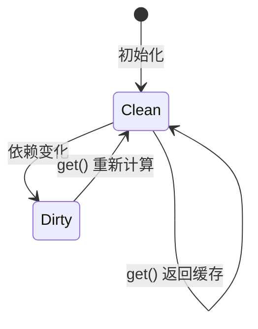

# 核心 API 规格

> **Singularity = Zustand 的简单 + Redux 的追踪 + Jotai 的细粒度**
>
> 本文档包含完整 API 规范，可直接用于开发。

---

## 一、API 总览

| API                  | 类型  | 用途                 |
| :------------------- | :---- | :------------------- |
| `atom(value)`        | Core  | 创建可追踪的原子状态 |
| `computed(fn)`       | Core  | 创建派生状态         |
| `effect(fn)`         | Core  | 创建副作用           |
| `batch(fn)`          | Core  | 批量更新             |
| `useAtom(atom)`      | React | 订阅状态             |
| `useAtomValue(atom)` | React | 只读订阅             |

---

## 二、Core API

### 2.1 atom

```typescript
interface Atom<T> {
  /** 唯一标识符 */
  readonly id: string;

  /** 获取当前值 */
  get(): T;

  /** 设置新值 */
  set(next: T | ((prev: T) => T)): void;

  /** 订阅变化 */
  subscribe(listener: () => void): () => void;

  /** 获取变化历史（开发模式） */
  history(): HistoryEntry<T>[];

  /**
   * 恢复到历史状态（开发模式）
   * - 目标值为 history[index].from
   * - 不新增历史记录，但会通知订阅者
   * - index 越界时无操作
   */
  restore(index: number): void;
}

interface HistoryEntry<T> {
  from: T;
  to: T;
  time: number;
  stack?: string; // 调用栈（可选）
}

function atom<T>(initial: T): Atom<T>;
```

**使用示例：**

```typescript
const count = atom(0);

// 读取
count.get(); // 0

// 写入
count.set(1);
count.set((prev) => prev + 1);

// 订阅
const unsubscribe = count.subscribe(() => {
  console.log('changed:', count.get());
});

// 查看历史（开发模式）
count.history();
// [{ from: 0, to: 1, time: 1704700000000 }, ...]

// 恢复状态（开发模式）
count.restore(0); // 恢复到初始值
```

---

### 2.2 computed

```typescript
interface Computed<T> {
  /** 唯一标识符 */
  readonly id: string;

  /** 获取计算值（惰性计算） */
  get(): T;

  /** 订阅变化 */
  subscribe(listener: () => void): () => void;
}

function computed<T>(read: () => T): Computed<T>;
```

**使用示例：**

```typescript
const price = atom(100);
const quantity = atom(2);

const total = computed(() => price.get() * quantity.get());

total.get(); // 200

price.set(150);
total.get(); // 300 (自动重新计算)
```

**设计要点：**

- 惰性计算：只在 `get()` 时计算
- 自动依赖追踪：无需手动声明
- 缓存结果：依赖不变时不重复计算

**Computed 状态流转：**



---

### 2.3 effect

```typescript
interface Effect {
  /** 销毁副作用 */
  dispose(): void;
}

function effect(fn: () => void | (() => void)): Effect;
```

**使用示例：**

```typescript
const user = atom({ name: 'Alice' });

// 基础用法
const e1 = effect(() => {
  console.log('User:', user.get().name);
});

// 带清理函数
const e2 = effect(() => {
  const ws = new WebSocket('/chat');
  return () => ws.close(); // 清理
});

// 销毁
e1.dispose();
```

---

### 2.4 batch

```typescript
function batch(fn: () => void): void;
```

**使用示例：**

```typescript
const a = atom(0);
const b = atom(0);

// 不用 batch：触发 2 次更新
a.set(1);
b.set(2);

// 用 batch：只触发 1 次更新
batch(() => {
  a.set(10);
  b.set(20);
});
```

---

## 三、React API

### 3.1 useAtom

```typescript
function useAtom<T>(atom: Atom<T> | Computed<T>): T;
function useAtom<T, R>(atom: Atom<T>, selector: (value: T) => R): R;
```

**使用示例：**

```typescript
function Counter() {
  const count = useAtom(countAtom);
  return <div>{count}</div>;
}

// 带 selector（细粒度订阅）
function UserName() {
  const name = useAtom(userAtom, u => u.name);
  return <div>{name}</div>; // 只有 name 变化才重渲染
}
```

### 3.2 useAtomValue

```typescript
function useAtomValue<T>(atom: Atom<T> | Computed<T>): T;
```

**使用示例：**

```typescript
function Display() {
  const total = useAtomValue(totalComputed);
  return <div>Total: {total}</div>;
}
```

---

## 四、实现要点

### 4.1 React 并发兼容

**必须使用 `useSyncExternalStore`：**

```typescript
import { useSyncExternalStore } from 'react';

export function useAtom<T>(atom: Atom<T>): T {
  return useSyncExternalStore(
    atom.subscribe,
    atom.get,
    atom.get, // SSR
  );
}
```

### 4.2 追踪实现

```typescript
function atom<T>(initial: T): Atom<T> {
  let value = initial;
  const history: HistoryEntry<T>[] = [];

  return {
    get: () => value,
    set: (next) => {
      const newValue = typeof next === 'function' ? next(value) : next;

      // 开发模式：记录历史
      if (process.env.NODE_ENV !== 'production') {
        history.push({ from: value, to: newValue, time: Date.now() });
      }

      value = newValue;
      notify();
    },
    history: () => [...history],
    restore: (index) => {
      const entry = history[index];
      if (entry) {
        value = entry.from; // restore 不应新增历史记录
        notify();
      }
    },
    // ...
  };
}
```

### 4.3 批处理实现

```typescript
let batchDepth = 0;
const pendingUpdates = new Set<() => void>();

function batch(fn: () => void): void {
  batchDepth++;
  try {
    fn();
  } finally {
    batchDepth--;
    if (batchDepth === 0) {
      pendingUpdates.forEach((update) => update());
      pendingUpdates.clear();
    }
  }
}
```

---

## 五、类型定义

```typescript
// 完整类型导出
export { atom, computed, effect, batch };
export type { Atom, Computed, Effect, HistoryEntry };
```

---

## 六、边界行为

| 场景                   | 行为           |
| :--------------------- | :------------- |
| 循环依赖               | 抛出错误       |
| computed 内写入        | 抛出错误       |
| 嵌套 batch             | 合并为单一批次 |
| 生产模式调用 history() | 返回空数组     |

**说明：**

- 循环依赖检测使用 computed 计算栈；当某个 computed 在计算中再次
  被访问时，抛错并停止追踪。
- computed 计算阶段禁止任何写入（set/restore）；effect 内写入允许。
- restore 只回退到 history[index].from，不追加历史记录，但会通知订阅者；
  index 越界时无操作。

---

_API 规格 v2.0 - 2026-01-08_
